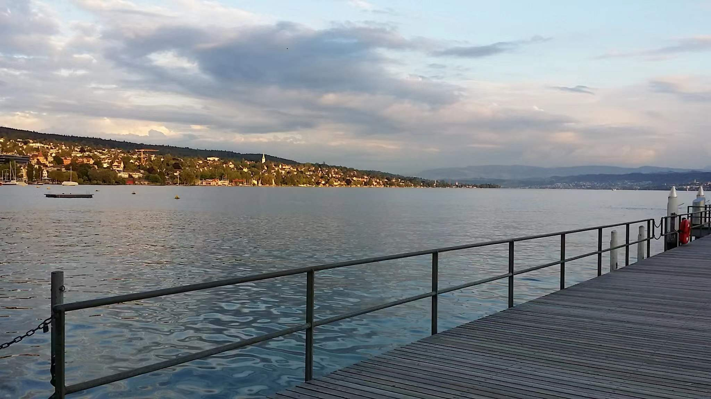

## Yue Wang (王跃)

*“May you remember to enjoy the road, especially when it's a hard one.” - Kobe Bryant.*

### Brief bio

I am a Master Student at Harbin Engineering University, before that I completed my bachelor's degree at Shandong University of Science and Technology. 
My previous research is focused on developing an Autonomous Underwater Vehicle (AUV) using Computer Vision and Machine Learning which would be capable of underwater intervention.Now, I am doing an internship at [Goertek](https://www.goertek.com/). Mainly working on VR/AR and SLAM. 
I am passionate about continually learning new and exciting things, and particularly things related to engineering and technology.

---

### News

- 2022.06.30 I gave an oral presentation on **IEEE ICCA 2022**. Video here: [Bilibili](https://www.bilibili.com/video/BV1JT41137RZ?spm_id_from=333.999.0.0)
- 2022.04.17 One paper got accepted by **IEEE ICCA 2022**.

---

### Publications

##### Journal papers

- **NONE**

##### Conference papers

- Di Wu, **Yue Wang**\* et al. **Performance Analysis of Feature Extraction Methods towards Underwater VSLAM**, *IEEE ICCA 2022*, accepted. [[Published](https://ieeexplore.ieee.org/document/9831964)]

---

### Projects

- **ROS simulator for underwater robotics** (Jul. 2021 - Apr. 2022)

  A simulator for underwater vehicles mounted with different sensors, such as sonar, camera and IMU.

---

### Academic Services

- IEEE Student Member
- IEEE Computational Intelligence Society Membership

---

### Useful links

- [Google scholar]() 

- [Twitter](https://twitter.com/yuewanggg) 

---

### Contact me

- yuewangg@outlook.com (academic)
