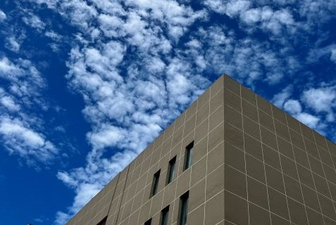

## Yue Wang (王跃)

*Cherish your love and family.*

### Brief bio

I am currently a Ph.D. candidate at Zhejiang University, under the supervision of Prof. [Ronghao Zheng](https://person.zju.edu.cn/ronghaozheng) and Prof. [Meiqin Liu](https://person.zju.edu.cn/mliu). My research interests include SLAM, control and planning in robotics.

---

### News

- 2022.06.30 I gave an oral presentation on **IEEE ICCA 2022**. Video here: [Bilibili](https://www.bilibili.com/video/BV1JT41137RZ?spm_id_from=333.999.0.0)
- 2022.04.17 One paper got accepted by **IEEE ICCA 2022**.

---

### Publications

##### Journal papers

- **Yang Xu**, Ronghao Zheng\*, Meiqin Liu et al. **CRMI: Confidence-rich Mutual Information for Information-theoretic Mapping**, *IEEE Robotics and Automation Letters (**RA-L**)*, 6(4): 6434 - 6441, 2021. (presented at **IROS 2021**) [DOI: 10.1109/LRA.2021.3093023](https://ieeexplore.ieee.org/document/9466474).(fake)

##### Conference papers

- Di Wu, **Yue Wang**\* et al. **Performance Analysis of Feature Extraction Methods towards Underwater VSLAM**, *IEEE ICCA 2022*, accepted. [[Preprint on arxiv]()]

---

### Projects

- **ROS simulator for underwater robotics** (Jul. 2019 - Apr. 2020)

  A simulator for underwater vehicles mounted with different sensors, such as sonar, camera and IMU.

---

### Academic Services

- IEEE Student Member

---

### Useful links

- [Google scholar]() 

- [Researchgate]() 

---

### Contact me

- yuewangg@outlook.com (academic)
